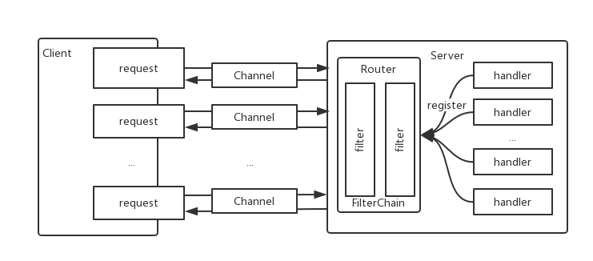

## Magic-rest
A http server based on netty inspired by java servlet and node express
### Features
1. extremely lightwight out-of-box http server
2. big file transport support zero-copy
3. support http keep-alive,cookies,gzip
4. support static resources and browser cache
5. support freemarker template to render html
6. use netty's asynchronous and zero-copy
7. simple to use and learn
### Hello World
1. 定义Person实体类,用于展示json解析功能
```java
public class Person {
	private String name;
	private Integer age;
	public String getName() {
		return name;
	}
	public void setName(String name) {
		this.name = name;
	}
	public Integer getAge() {
		return age;
	}
	public void setAge(Integer age) {
		this.age = age;
	}
	public Person(String name, Integer age) {
		super();
		this.name = name;
		this.age = age;
	}
	
}
```
2. Hello World 示例
```java
import java.util.HashMap;
import java.util.Map;

import com.homura.magic.server.bootstrap.Magic;
import com.homura.magic.server.core.MagicRequest;
import com.homura.magic.server.core.MagicResponse;
import com.homura.magic.server.core.handler.MagicHandler;
import com.homura.magic.server.core.handler.StaticResourceHandler;
import com.homura.magic.server.core.plugin.StaticResourcePlugin;
import com.homura.magic.server.router.MagicRouter;

import io.netty.handler.codec.http.cookie.DefaultCookie;

public class HelloWorld {

	public static void main(String[] args) throws InterruptedException {
		new Magic().
        //创建并添加路由
		router(new MagicRouter()
                //注册处理器handler,必须调用response.flush()输出响应流
				.get("/freemarker/hello", new MagicHandler() {
					@Override
					public void handle(MagicRequest request, MagicResponse response) throws Exception {
						Map<String, Object> attr=new HashMap<>();
						attr.put("name", "hello world");
						response.render("hello.ftl", attr).flush();
					}
				})
                //支持ant风格的url匹配模式,内部借用spring-core中org.springframework.util.AntPathMatcher实现
				.get("/hello*", new MagicHandler() {

			@Override
			public void handle(MagicRequest request, MagicResponse response) throws Exception {
                //内部使用fastjson作为json解析器				
				response.json(new Person("tom", 10)).addCookie(new DefaultCookie("a", "b"))
						.addCookie(new DefaultCookie("c", "d")).flush();
			}
		})
				)
        //注册静态资源处理插件
		.plugins(new StaticResourcePlugin("/statics/**", new StaticResourceHandler("classpath:static/assets"))
				)
        //注册freemarker模板插件,模板以.ftl后缀结尾
		.templateRoot("/template")
        //绑定至8080端口,并启动服务器
		.bind(8080);
	}
}
```
3. that's all,just enjoy,it's a pretty gift for you to leran netty and httpcodec.
### Architchture

use the concept of servlet's request,response and FilterChain
### To be done
1. https support
2. rest style support
3. annotation support maybe